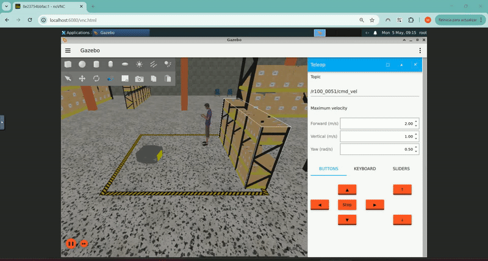

# Pilot02 Digital Twin Clearpath  Simulator

This repository contains a Docker-based version of the Clearpath simulator ([https://github.com/clearpathrobotics/clearpath_simulator/tree/humble](https://github.com/clearpathrobotics/clearpath_simulator/tree/humble)), which includes NoVNC web services for visualization. By running this container, users can access the ClearPath  Simulator's graphical interface through a web browser at [http://localhost:6080/vnc.html](http://localhost:6080/vnc.html), providing an easy way to interact with simulations remotely using a VNC viewer or through the NoVNC web interface. 
The container also allows for configuring the simulation environment and launching different Gazebo worlds or robots by specifying launch files and adjusting the container's environment variables. By default, a simple robot model and its corresponding launch file are included; however, they may be modified for future reuse.

The Clearpath simulator is built using **Gazebo Harmonic** to provide a physics-based environment for Clearpath robot simulation. It enables users to simulate **multiple robots simultaneously**, and is tightly integrated with the **Clearpath Config** system.

## Key Features

- Based on **Gazebo Harmonic**
- Supports **ROS 2 Humble**
- Enables simulation of **multiple robots**
- Bridges Gazebo data to **ROS 2**, following the **Clearpath API**
- Useful for:
  - Iterating on robot configurations
  - Testing control systems
  - Developing and validating navigation software

You can access the simulator's source code on GitHub:  
**https://github.com/clearpathrobotics/clearpath_simulator/tree/humble**  
Make sure to use the branch:  
`ros2/humble`

For more detailed instructions and tutorials, refer to the official documentation:  
[https://docs.clearpathrobotics.com/docs/ros/tutorials/simulator/overview/](https://docs.clearpathrobotics.com/docs/ros/tutorials/simulator/overview/)


The repository includes the following components:
- Docker setup for easy containerization
- A Docker compose-based test environment for a simple model and world

## Guidelines for build and test the component 

### 1. **Build the Main Docker Image:**

In this step, we build the Docker image using the provided `Dockerfile`. The image is named `pilot02-digitaltwin-clearpathsimulator`.

```bash
cd clearpath
docker build -t pilot02-digitaltwin-clearpathsimulator .
```
Make sure the path to your configuration file is correctly mapped to the Docker container.

### 2. **Run the ROS 2 Container:**

After building the Docker image, you can run the container using the following command:

```bash
docker run pilot02-digitaltwin-clearpathsimulator
```

### 3. **Build and Run the test automation:**

Test automation is integrated by docker-compose file:

Run: 
```bash
docker-compose up --build
```
After execution, you will be able to see at [Localhost →](http://localhost:6080/vnc.html) the web based access to the gazebo environment. By default use '1234' as password.

Example of a simple AGV model and world:



## Contributing

Feel free to open issues or submit pull requests. Contributions are welcome!

## License

This project is licensed under BSD 3-Clause License - see the [LICENSE](LICENSE) file for details.